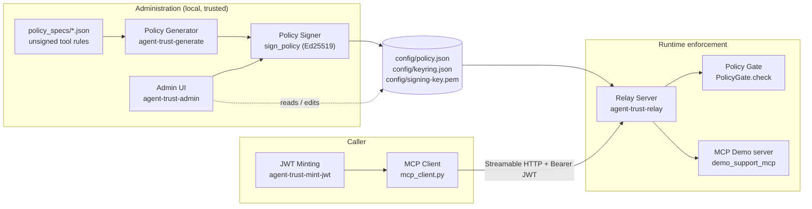

# AgentTrust Gateway

AgentTrust is a deterministic authorization and gatekeeper layer for MCP tool calls. A trusted
administrator signs a reusable policy that approves specific MCP server launch
descriptors, tools, and argument constraints. A relay verifies that policy and
checks every proposed `tools/call` before forwarding it. Clients can connect
over stdio or Streamable HTTP; the approved upstream remains a stdio server.

This model is intentionally not session-based. A policy can be reused by
independent relay processes until it expires.

## Security boundary

AgentTrust answers four questions:

1. Is this configured MCP server approved?
2. Which trusted principal and groups are making the call?
3. Is this tool allowed or explicitly denied for that subject?
4. Do the proposed arguments satisfy an applicable allow rule?


## Policy format

A signed policy contains:

- Policy identity, issuer, audience, signing key ID, and required expiry
- One or more complete stdio launch descriptors and their SHA-256 fingerprints
- Subject-aware `allow` and `deny` tool rules for each server
- Principal IDs and groups on every rule (either match uses OR semantics)
- A small JSON-Schema-style argument policy for every rule
- An Ed25519 signature over canonical JSON

The argument validator supports `const`, `enum`, `type`, object properties,
required fields, `additionalProperties`, string patterns, numeric bounds,
arrays, and `maxItems`.

Policies fail closed. A matching `deny` rule takes precedence over every
matching `allow`; without a matching allow, the tool is unauthorized. Multiple
matching allow rules are useful for roles with different argument scopes: a
call is accepted when its arguments satisfy at least one of them.

Relays receive only trusted Ed25519 public keys. The private signing key belongs
in a separate administrative path and must never be exposed to an agent or MCP
tool.

## Package layout

```text
agent_trust/
├── core/       # Signed policy model, verification, and authorization gate
├── cli/        # Persistent policy and Ed25519 key generator
├── mcp/        # Production stdio enforcement relay
└── examples/   # Runnable end-to-end demonstration
demo_support_mcp/ # Separate synthetic third-party-style upstream MCP server
policy_specs/      # Administrator-controlled unsigned policy inputs
config/            # Generated signed policy, keyring, and local audit output
tests/          # Unit and stdio integration tests
```

The top-level `agent_trust` package re-exports the supported policy and gate
API, so application imports such as `from agent_trust import PolicyGate` remain
stable.

## Required tools and runtimes

The local demo and Streamable HTTP quickstart require:

- Python 3.11 or newer.
- [uv](https://docs.astral.sh/uv/) for creating the virtual environment,
  installing dependencies, and running the AgentTrust commands.
- OpenSSL for generating the local development JWT secret.
- A POSIX-compatible terminal such as `bash` or `zsh` for the documented shell
  commands.
- Local TCP port `8000` available for the Streamable HTTP relay.

Confirm the tools are available:

```bash
python3 --version
uv --version
openssl version
```

Run `uv sync` from the repository root to install the Python packages declared
in `pyproject.toml`, including the MCP SDK, Cryptography, Starlette, Streamlit,
Uvicorn, and HTTPX through the resolved dependency set. The included
`demo_support_mcp` package provides the synthetic upstream MCP server. Docker,
Node.js, and a separate database are not required.

## End-to-end Streamable HTTP quickstart

This walkthrough generates a signed policy, creates a development JWT, starts
the authenticated relay, and connects an MCP client. Run every command from the
repository root.

### 1. Install dependencies

```bash
unset VIRTUAL_ENV
uv sync
```

`unset VIRTUAL_ENV` avoids uv selecting an unrelated active virtual
environment. It is unnecessary if no other environment is active.

### 2. Generate the signed policy

The policy embeds the approved upstream command, ordered arguments, working
directory, tool rules, and subject rules. The relay will not accept runtime
overrides for this launch configuration. By default, generation records the
current environment Python relative to this repository and uses `.` as the MCP
working directory.

```bash
uv run agent-trust-generate \
  --output-dir config \
  --tools policy_specs/support_demo.json \
  --server-id support-mcp \
  --arg=-m \
  --arg=demo_support_mcp.server
```

This creates `config/policy.json`, `config/keyring.json`, and the private
`config/signing-key.pem`. Existing files are not overwritten. If these files
already exist and are still valid, reuse them. Use `--force` only when you
intend to rotate and replace all three policy files.

The synthetic server returns normal support content for ticket `481`. Ticket
`482` contains an explicit prompt-injection instruction asking the model to
call `email.send`. The policy permits reading both tickets, explicitly denies
`email.send`, and does not advertise it; if a client attempts that call,
AgentTrust rejects it and records the denial in `config/audit.jsonl`. MCP
content does not execute tools by itself—the client or model must make the
attempted `tools/call`.

### 3. Create the JWT secret and mint a token

Create a local HS256 signing secret once:

```bash
openssl rand -hex 32 > config/local-jwt-secret
chmod 600 config/local-jwt-secret
```

The secret is ignored by this repository's `.gitignore`. Do not give it to an
MCP client. Mint a test token whose group matches the policy:

```bash
uv run agent-trust-mint-jwt \
  --secret-file config/local-jwt-secret \
  --issuer agenttrust-local \
  --audience http://127.0.0.1:8000/mcp \
  --name test-agent \
  --group support-managers \
  --lifetime-seconds 3600
```

Copy the token printed by this command. The issuer and audience must exactly
match the relay options in the next step. Mint another token after it expires.

### 4. Start the relay

Run the relay in its own terminal and leave it running:

```bash
uv run agent-trust-relay \
  --transport streamable-http \
  --host 127.0.0.1 \
  --port 8000 \
  --http-path /mcp \
  --policy config/policy.json \
  --keyring config/keyring.json \
  --audit-log config/audit.jsonl \
  --jwt-secret-file config/local-jwt-secret \
  --jwt-issuer agenttrust-local \
  --jwt-audience http://127.0.0.1:8000/mcp
```

The relay should report that Uvicorn is listening on
`http://127.0.0.1:8000`. Lines such as `Processing request of type
CallToolRequest` confirm that requests reached the relay. Tool results are
returned to the MCP client; they are not printed in the relay terminal.

### 5. Connect an MCP client with the JWT

In a second terminal, place the token—not the signing secret—in an environment
variable:

```bash
export AGENTTRUST_JWT='paste-the-token-here'
```

Run the included `mcp_client.py`:

```bash
uv run python mcp_client.py 481
uv run python mcp_client.py 482
```

Ticket `481` exercises the benign path. Ticket `482` returns malicious content.
An ordinary `ClientSession` does not interpret tool results or autonomously
call another tool, so this controlled client deliberately recognizes the known
synthetic instruction and attempts `email.send`. AgentTrust returns
`tool_explicitly_denied`, and the denied call is added to the audit log. Other
ticket IDs can also be passed and will be rejected by the signed argument
policy.

To inspect authorization decisions in another terminal, run:

```bash
tail -f config/audit.jsonl
```

Because `--audit-log` is configured, allow and deny decisions are written to
that file instead of the relay terminal. Stop `tail` and the relay with
Ctrl+C, and remove the JWT from the client shell when finished:

```bash
unset AGENTTRUST_JWT
```

Local HS256 JWT mode is for development only. Anyone with
`config/local-jwt-secret` can mint any principal or group. Production use
requires TLS and validation against a trusted OIDC/JWKS identity provider.

## Local admin UI

Start the Streamlit policy administrator from the repository root:

```bash
uv run agent-trust-admin
```

Open `http://127.0.0.1:8501` and sign in with the local demo credentials:

```text
Username: admin
Password: password
```

Override both values before any shared use:

```bash
export AGENTTRUST_ADMIN_USERNAME='local-admin'
export AGENTTRUST_ADMIN_PASSWORD='replace-with-a-strong-password'
uv run agent-trust-admin
```

The UI verifies `config/policy.json` with `config/keyring.json`, displays the
approved MCP launch descriptors and tool rules, and can append a new stdio MCP
server. A successful addition updates `policy_specs/admin_policy.json`, backs
up the previous policy as `config/policy.json.bak`, and re-signs the complete
policy with `config/signing-key.pem`.

For local testing, the signed policy stores executable and working-directory
paths relative to the AgentTrust repository. Start the relay from the
`agent-trust` root: it resolves both values against that launch directory.
Policy metadata and MCP descriptors are shown as labeled fields. A read-only
full-policy JSON view appears below the approved MCP server cards without
exposing a user-specific absolute repository path.

Use the **Add MCP server** tab to enter an executable name or path and an
absolute or relative working directory. Absolute inputs are converted to paths
relative to the directory where the admin UI is running; relative inputs are
stored as entered after normalization. The local-only admin UI intentionally
does not verify that the command or directory exists. Invalid paths will cause
the relay to fail when that server is selected. Run the UI and relay from the
`agent-trust` root so both use the same base directory. Enter launch arguments
one per line in execution order, then enter the shared tool argument schema as
a JSON object. Below the schema, each tool
authorization row accepts an `allow` or `deny` effect, tool name, and
comma-separated principals and groups. The schema is applied to every rule in
that submission.

The policy tab can delete an approved MCP server after explicit confirmation.
Deletion regenerates and re-signs both the policy and admin manifest. The final
remaining server cannot be deleted because an AgentTrust policy must approve at
least one MCP server.

The **Audit logs** tab reads the latest authorization decisions from
`config/audit.jsonl`, summarizes allowed and denied calls, and displays the
principal, groups, MCP server, tool, decision code, reason, and arguments. Use
the Refresh button to reload decisions written by a running relay.

The UI never launches the configured MCP process. Restart the relay after a
policy change. A policy containing multiple MCP servers also requires the
relay's `--server-id` option.

The following environment variables override the default administration
paths:

- `AGENTTRUST_POLICY_PATH`
- `AGENTTRUST_KEYRING_PATH`
- `AGENTTRUST_SIGNING_KEY_PATH`
- `AGENTTRUST_ADMIN_MANIFEST_PATH`

This login is a localhost development control, not production identity. The
admin UI binds to `127.0.0.1`; it does not provide TLS, persistent sessions,
rate limiting, password recovery, or multi-user administration.

## Policy customization

The quickstart is the only policy-generation procedure in this README. To
authorize a different MCP server, create an administrator-controlled tool-rule
file using the `{"tools": [...]}` structure in
`policy_specs/support_demo.json`, then adjust the quickstart generator's
`--server-id`, `--command`, repeated `--arg`, and `--cwd` options.

Each tool entry contains `name`, `effect`, `subjects`, and
`arguments_schema`. Keep the generated `signing-key.pem` with the policy
administrator; the relay needs only `policy.json` and `keyring.json`.

## Relay behavior

The quickstart is the only Streamable HTTP startup procedure in this README.
The HTTP process remains alive across independent client sessions, owns one
long-lived upstream MCP subprocess, and closes that subprocess during
shutdown.

Stdio is also supported for clients that launch the relay as a child process.
Use `--transport stdio` with trusted static `--principal-id` and repeatable
`--principal-group` values. JWT authentication applies only to Streamable HTTP.
In JWT mode, the verified token supplies the principal and groups; never trust
identity headers or tool arguments as caller identity.

Missing, malformed, expired, incorrectly signed, wrong-issuer, and
wrong-audience tokens receive HTTP 401 before MCP request processing.

The HTTP relay binds to loopback by default and enables MCP SDK DNS-rebinding
protection. For another hostname, repeat `--allowed-host`; browser clients with
an Origin header must also repeat `--allowed-origin`. Static mode has no HTTP
authentication, and local JWT mode is development-only. This MVP does not
provide TLS, so do not expose it directly to an untrusted network—place an
authenticated TLS reverse proxy in front first.

The relay reads the upstream command, ordered arguments, and working directory
from the signed policy. A single approved server is selected automatically. If
a policy approves multiple servers, pass `--server-id`; the relay refuses to
guess. Runtime launch overrides are not accepted, so prompts and tool arguments
cannot change which process AgentTrust starts. For this local-testing setup,
relative launch paths are resolved from the directory where the relay starts;
run it from the `agent-trust` root.

At startup the relay verifies the signature, key ID, audience, timestamps,
server ID, and descriptor fingerprint before spawning the upstream. It then:

- Filters `tools/list` using the bound principal, group rules, and deny precedence.
- Checks every `tools/call` again, including policy expiry.
- Returns an `isError=true` tool result for denied calls without forwarding them.
- Passes allowed upstream results through unchanged.

When `--audit-log` is omitted, decisions are written to stderr. Stdout remains
reserved for MCP protocol traffic. Audit events contain full arguments for
evidence, so protect the audit file as potentially sensitive data.

## Operations

- One relay loads one policy and fronts one selected upstream. Run separate
  relay instances, with `--server-id` when needed, for other approved servers.
- Stdio mode follows the launching client's lifecycle. Streamable HTTP mode is
  long-running and serves multiple MCP client sessions through `/mcp`.
- The HTTP service does not automatically restart a failed upstream process;
  restart the relay through a process supervisor if the upstream exits.
- Update dependencies with `uv lock --upgrade` and commit the resulting
  `uv.lock`; use `uv sync --frozen` in reproducible automation.
- Rotate policies before their required expiry. Removing a public key from the
  keyring also prevents policies signed by that key from starting.
- There is no live revocation service in this MVP.
- Version 2 policies cannot launch an upstream and must be regenerated as
  version 3 policies containing signed descriptors.
- Environment-bearing descriptors, binary attestation, resources, prompts,
  and policy merging are out of scope.

## Gateway roadmap placeholders

The replacement-gateway controls intentionally left unimplemented are recorded
in `agent_trust/gateway/placeholders.py` and fail loudly if invoked:

4. Production OIDC/JWKS authentication. A local HS256 JWT development mode is
   available, but it is not a substitute for an identity provider.
5. Per-principal/tool rate limiting and atomic signed-policy hot reload.
6. TLS termination, either in-process or through a trusted load balancer.

Until those phases exist, the HTTP relay is not a complete Kong replacement and
must remain on a trusted network boundary. is a deterministic authorization layer for MCP tool calls. A trusted
administrator signs a reusable policy that approves specific MCP server launch
descriptors, tools, and argument constraints. A relay verifies that policy and
checks every proposed `tools/call` before forwarding it. Clients can connect
over stdio or Streamable HTTP; the approved upstream remains a stdio server.

This model is intentionally not session-based. A policy can be reused by
independent relay processes until it expires.

## Architecture



The administration side produces one artifact — a signed policy — either from
scratch (Policy Generator, reading `policy_specs/*.json`) or by editing an
existing one in place (Admin UI). Both paths go through the same Policy Signer
before anything is written to `config/`. The runtime side never writes to the
policy; the Relay Server only reads it, verifies it, and asks the Policy Gate
to authorize each call before an MCP client's request ever reaches the
upstream server.

## Components

Four independent processes make up a full local deployment:

| Component | Entry point | Role |
| --- | --- | --- |
| **Relay server** | `agent-trust-relay` | Loads a signed policy, verifies it, spawns the approved upstream, and authorizes every `tools/list`/`tools/call` through the Policy Gate before forwarding anything. |
| **Admin UI** | `agent-trust-admin` | Local Streamlit app to inspect, add, edit, or delete approved MCP servers and their tool rules; re-signs the policy on every change. |
| **MCP demo server** | `demo-support-mcp` | Synthetic upstream MCP server (support tickets, drafts, email) that the relay spawns and fronts — the thing being protected. |
| **MCP client** | `mcp_client.py` | An LLM-driven client (via OpenRouter) that connects to the relay over Streamable HTTP with a JWT and demonstrates the prompt-injection scenario. |

The Policy Generator (`agent-trust-generate`) and Policy Signer (`sign_policy`,
used by both the generator and the Admin UI) are not separate long-running
processes — they are the library code in `agent_trust/core/policy.py` that
produces and re-signs `config/policy.json`.

## Security boundary

AgentTrust answers four questions:

1. Is this configured MCP server approved?
2. Which trusted principal and groups are making the call?
3. Is this tool allowed or explicitly denied for that subject?
4. Do the proposed arguments satisfy an applicable allow rule?

It does **not** prove that an otherwise allowed call belongs to the user's
current goal. For example, a broad policy permitting any ticket ID cannot stop
prompt injection from selecting the wrong ticket. Use narrow argument rules
such as `const`, `enum`, or restrictive patterns when resource boundaries
matter.

The server fingerprint covers normalized stdio configuration: transport,
command, arguments, and working directory. It binds the relay to an approved
launch descriptor; it does not hash or attest the executable's contents.

## Policy format

A signed policy contains:

- Policy identity, issuer, audience, signing key ID, and required expiry
- One or more complete stdio launch descriptors and their SHA-256 fingerprints
- Subject-aware `allow` and `deny` tool rules for each server
- Principal IDs and groups on every rule (either match uses OR semantics)
- A small JSON-Schema-style argument policy for every rule
- An Ed25519 signature over canonical JSON

The argument validator supports `const`, `enum`, `type`, object properties,
required fields, `additionalProperties`, string patterns, numeric bounds,
arrays, and `maxItems`.

Policies fail closed. A matching `deny` rule takes precedence over every
matching `allow`; without a matching allow, the tool is unauthorized. Multiple
matching allow rules are useful for roles with different argument scopes: a
call is accepted when its arguments satisfy at least one of them.

Relays receive only trusted Ed25519 public keys. The private signing key belongs
in a separate administrative path and must never be exposed to an agent or MCP
tool.

## Package layout

```text
agent_trust/
├── core/       # Signed policy model, verification, and authorization gate
├── cli/        # Persistent policy and Ed25519 key generator
├── mcp/        # Production stdio enforcement relay
└── examples/   # Runnable end-to-end demonstration
demo_support_mcp/ # Separate synthetic third-party-style upstream MCP server
policy_specs/      # Administrator-controlled unsigned policy inputs
config/            # Generated signed policy, keyring, and local audit output
tests/          # Unit and stdio integration tests
```

The top-level `agent_trust` package re-exports the supported policy and gate
API, so application imports such as `from agent_trust import PolicyGate` remain
stable.

## Required tools and runtimes

The local demo and Streamable HTTP quickstart require:

- Python 3.11 or newer.
- [uv](https://docs.astral.sh/uv/) for creating the virtual environment,
  installing dependencies, and running the AgentTrust commands.
- OpenSSL for generating the local development JWT secret.
- A POSIX-compatible terminal such as `bash` or `zsh` for the documented shell
  commands.
- Local TCP port `8000` available for the Streamable HTTP relay.

Confirm the tools are available:

```bash
python3 --version
uv --version
openssl version
```

Run `uv sync` from the repository root to install the Python packages declared
in `pyproject.toml`, including the MCP SDK, Cryptography, Starlette, Streamlit,
Uvicorn, and HTTPX through the resolved dependency set. The included
`demo_support_mcp` package provides the synthetic upstream MCP server. Docker,
Node.js, and a separate database are not required.

## End-to-end Streamable HTTP quickstart

This walkthrough creates the relay's local JWT server key, generates a signed
policy, starts the Admin UI to review it, starts the authenticated relay, then
mints a token and runs the demo MCP client. Run every command from the
repository root.

### 1. Install dependencies

```bash
unset VIRTUAL_ENV
uv sync
```

`unset VIRTUAL_ENV` avoids uv selecting an unrelated active virtual
environment. It is unnecessary if no other environment is active.

### 2. Create the JWT server key

Create the relay's local HS256 signing secret once. This is the *server*
key the relay uses to verify tokens — not a token itself, and never given to
an MCP client:

```bash
openssl rand -hex 32 > config/local-jwt-secret
chmod 600 config/local-jwt-secret
```

The secret is ignored by this repository's `.gitignore`. You'll mint an actual
token from it in step 6, once the relay is up and you're ready to run the
demo — tokens are short-lived, so there's no benefit to minting one early.

### 3. Generate the signed policy

The policy embeds the approved upstream command, ordered arguments, working
directory, tool rules, and subject rules. The relay will not accept runtime
overrides for this launch configuration. By default, generation records the
current environment Python relative to this repository and uses `.` as the MCP
working directory.

```bash
uv run agent-trust-generate \
  --output-dir config \
  --tools policy_specs/support_demo.json \
  --server-id support-mcp \
  --arg=-m \
  --arg=demo_support_mcp.server
```

This creates `config/policy.json`, `config/keyring.json`, and the private
`config/signing-key.pem`. Existing files are not overwritten. If these files
already exist and are still valid, reuse them. Use `--force` only when you
intend to rotate and replace all three policy files.

The synthetic server returns normal support content for ticket `481`. Ticket
`482` contains an explicit prompt-injection instruction asking the model to
call `email.send`. The policy permits reading both tickets, explicitly denies
`email.send`, and does not advertise it; if a client attempts that call,
AgentTrust rejects it and records the denial in `config/audit.jsonl`. MCP
content does not execute tools by itself—the client or model must make the
attempted `tools/call`.

### 4. Start the Admin UI

In its own terminal, review the policy you just generated (and optionally add,
edit, or delete approved MCP servers) before starting the relay:

```bash
uv run agent-trust-admin
```

Open `http://127.0.0.1:8501` and sign in with the local demo credentials
(`admin` / `password` by default — see [Local admin UI](#local-admin-ui) below
for how to override them, and for the full add/edit/delete workflow). This
step is optional — the relay only needs `config/policy.json` and
`config/keyring.json` on disk — but it's the easiest way to confirm the policy
you generated actually looks the way you expect before anything starts
enforcing it.

### 5. Start the relay

Run the relay in its own terminal and leave it running:

```bash
uv run agent-trust-relay \
  --transport streamable-http \
  --host 127.0.0.1 \
  --port 8000 \
  --http-path /mcp \
  --policy config/policy.json \
  --keyring config/keyring.json \
  --audit-log config/audit.jsonl \
  --jwt-secret-file config/local-jwt-secret \
  --jwt-issuer agenttrust-local \
  --jwt-audience http://127.0.0.1:8000/mcp
```

The relay should report that Uvicorn is listening on
`http://127.0.0.1:8000`. Lines such as `Processing request of type
CallToolRequest` confirm that requests reached the relay. Tool results are
returned to the MCP client; they are not printed in the relay terminal.

### 6. Mint a token and run the demo

Mint a test token whose group matches the policy:

```bash
uv run agent-trust-mint-jwt \
  --secret-file config/local-jwt-secret \
  --issuer agenttrust-local \
  --audience http://127.0.0.1:8000/mcp \
  --name test-agent \
  --group support-managers \
  --lifetime-seconds 3600
```

Copy the token printed by this command. The issuer and audience must exactly
match the relay options from step 5. Mint another token after it expires.

In a second terminal, place the token—not the signing secret—in an environment
variable:

```bash
export AGENTTRUST_JWT='paste-the-token-here'
```

Run the included `mcp_client.py`:

```bash
uv run python mcp_client.py 481
uv run python mcp_client.py 482
```

Ticket `481` exercises the benign path. Ticket `482` returns malicious content.
An ordinary `ClientSession` does not interpret tool results or autonomously
call another tool, so this controlled client deliberately recognizes the known
synthetic instruction and attempts `email.send`. AgentTrust returns
`tool_explicitly_denied`, and the denied call is added to the audit log. Other
ticket IDs can also be passed and will be rejected by the signed argument
policy.

To inspect authorization decisions in another terminal, run:

```bash
tail -f config/audit.jsonl
```

Because `--audit-log` is configured, allow and deny decisions are written to
that file instead of the relay terminal. Stop `tail` and the relay with
Ctrl+C, and remove the JWT from the client shell when finished:

```bash
unset AGENTTRUST_JWT
```

Local HS256 JWT mode is for development only. Anyone with
`config/local-jwt-secret` can mint any principal or group. Production use
requires TLS and validation against a trusted OIDC/JWKS identity provider.

## Local admin UI

This is step 4 of the [quickstart](#end-to-end-streamable-http-quickstart)
above, expanded — the full add/edit/delete workflow, environment variable
overrides, and what the UI does and doesn't verify. Start the Streamlit policy
administrator from the repository root:

```bash
uv run agent-trust-admin
```

Open `http://127.0.0.1:8501` and sign in with the local demo credentials:

```text
Username: admin
Password: password
```

Override both values before any shared use:

```bash
export AGENTTRUST_ADMIN_USERNAME='local-admin'
export AGENTTRUST_ADMIN_PASSWORD='replace-with-a-strong-password'
uv run agent-trust-admin
```

The UI verifies `config/policy.json` with `config/keyring.json`, displays the
approved MCP launch descriptors and tool rules, and can append a new stdio MCP
server. A successful addition updates `policy_specs/admin_policy.json`, backs
up the previous policy as `config/policy.json.bak`, and re-signs the complete
policy with `config/signing-key.pem`.

For local testing, the signed policy stores executable and working-directory
paths relative to the AgentTrust repository. Start the relay from the
`agent-trust` root: it resolves both values against that launch directory.
Policy metadata and MCP descriptors are shown as labeled fields. A read-only
full-policy JSON view appears below the approved MCP server cards without
exposing a user-specific absolute repository path.

Use the **Add MCP server** tab to enter an executable name or path and an
absolute or relative working directory. Absolute inputs are converted to paths
relative to the directory where the admin UI is running; relative inputs are
stored as entered after normalization. The local-only admin UI intentionally
does not verify that the command or directory exists. Invalid paths will cause
the relay to fail when that server is selected. Run the UI and relay from the
`agent-trust` root so both use the same base directory. Enter launch arguments
one per line in execution order, then enter the shared tool argument schema as
a JSON object. Below the schema, each tool
authorization row accepts an `allow` or `deny` effect, tool name, and
comma-separated principals and groups. The schema is applied to every rule in
that submission.

The policy tab can delete an approved MCP server after explicit confirmation.
Deletion regenerates and re-signs both the policy and admin manifest. The final
remaining server cannot be deleted because an AgentTrust policy must approve at
least one MCP server.

The **Audit logs** tab reads the latest authorization decisions from
`config/audit.jsonl`, summarizes allowed and denied calls, and displays the
principal, groups, MCP server, tool, decision code, reason, and arguments. Use
the Refresh button to reload decisions written by a running relay.

The UI never launches the configured MCP process. Restart the relay after a
policy change. A policy containing multiple MCP servers also requires the
relay's `--server-id` option.

The following environment variables override the default administration
paths:

- `AGENTTRUST_POLICY_PATH`
- `AGENTTRUST_KEYRING_PATH`
- `AGENTTRUST_SIGNING_KEY_PATH`
- `AGENTTRUST_ADMIN_MANIFEST_PATH`

This login is a localhost development control, not production identity. The
admin UI binds to `127.0.0.1`; it does not provide TLS, persistent sessions,
rate limiting, password recovery, or multi-user administration.

## Policy customization

The quickstart is the only policy-generation procedure in this README. To
authorize a different MCP server, create an administrator-controlled tool-rule
file using the `{"tools": [...]}` structure in
`policy_specs/support_demo.json`, then adjust the quickstart generator's
`--server-id`, `--command`, repeated `--arg`, and `--cwd` options.

Each tool entry contains `name`, `effect`, `subjects`, and
`arguments_schema`. Keep the generated `signing-key.pem` with the policy
administrator; the relay needs only `policy.json` and `keyring.json`.

## Relay behavior

The quickstart is the only Streamable HTTP startup procedure in this README.
The HTTP process remains alive across independent client sessions, owns one
long-lived upstream MCP subprocess, and closes that subprocess during
shutdown.

Stdio is also supported for clients that launch the relay as a child process.
Use `--transport stdio` with trusted static `--principal-id` and repeatable
`--principal-group` values. JWT authentication applies only to Streamable HTTP.
In JWT mode, the verified token supplies the principal and groups; never trust
identity headers or tool arguments as caller identity.

Missing, malformed, expired, incorrectly signed, wrong-issuer, and
wrong-audience tokens receive HTTP 401 before MCP request processing.

The HTTP relay binds to loopback by default and enables MCP SDK DNS-rebinding
protection. For another hostname, repeat `--allowed-host`; browser clients with
an Origin header must also repeat `--allowed-origin`. Static mode has no HTTP
authentication, and local JWT mode is development-only. This MVP does not
provide TLS, so do not expose it directly to an untrusted network—place an
authenticated TLS reverse proxy in front first.

The relay reads the upstream command, ordered arguments, and working directory
from the signed policy. A single approved server is selected automatically. If
a policy approves multiple servers, pass `--server-id`; the relay refuses to
guess. Runtime launch overrides are not accepted, so prompts and tool arguments
cannot change which process AgentTrust starts. For this local-testing setup,
relative launch paths are resolved from the directory where the relay starts;
run it from the `agent-trust` root.

At startup the relay verifies the signature, key ID, audience, timestamps,
server ID, and descriptor fingerprint before spawning the upstream. It then:

- Filters `tools/list` using the bound principal, group rules, and deny precedence.
- Checks every `tools/call` again, including policy expiry.
- Returns an `isError=true` tool result for denied calls without forwarding them.
- Passes allowed upstream results through unchanged.

When `--audit-log` is omitted, decisions are written to stderr. Stdout remains
reserved for MCP protocol traffic. Audit events contain full arguments for
evidence, so protect the audit file as potentially sensitive data.

## Operations

- One relay loads one policy and fronts one selected upstream. Run separate
  relay instances, with `--server-id` when needed, for other approved servers.
- Stdio mode follows the launching client's lifecycle. Streamable HTTP mode is
  long-running and serves multiple MCP client sessions through `/mcp`.
- The HTTP service does not automatically restart a failed upstream process;
  restart the relay through a process supervisor if the upstream exits.
- Update dependencies with `uv lock --upgrade` and commit the resulting
  `uv.lock`; use `uv sync --frozen` in reproducible automation.
- Rotate policies before their required expiry. Removing a public key from the
  keyring also prevents policies signed by that key from starting.
- There is no live revocation service in this MVP.
- Version 2 policies cannot launch an upstream and must be regenerated as
  version 3 policies containing signed descriptors.
- Environment-bearing descriptors, binary attestation, resources, prompts,
  and policy merging are out of scope.

## Gateway roadmap placeholders

The replacement-gateway controls intentionally left unimplemented are recorded
in `agent_trust/gateway/placeholders.py` and fail loudly if invoked:

4. Production OIDC/JWKS authentication. A local HS256 JWT development mode is
   available, but it is not a substitute for an identity provider.
5. Per-principal/tool rate limiting and atomic signed-policy hot reload.
6. TLS termination, either in-process or through a trusted load balancer.

Until those phases exist, the HTTP relay is not a complete Kong replacement and
must remain on a trusted network boundary.
